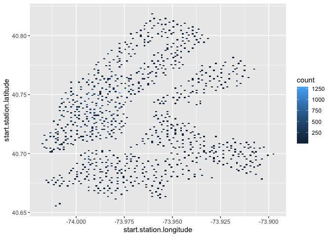
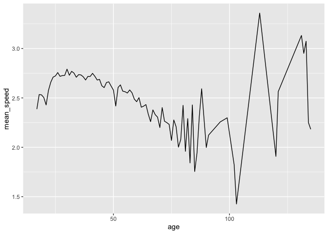
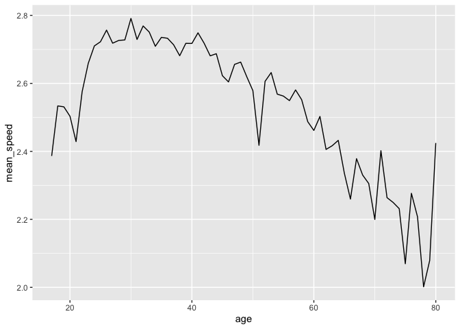
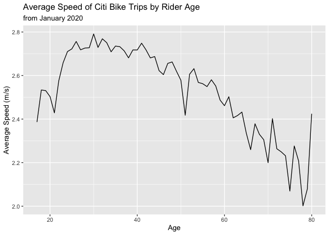
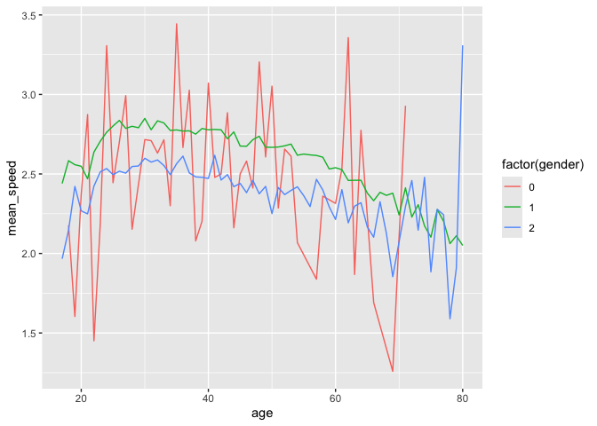
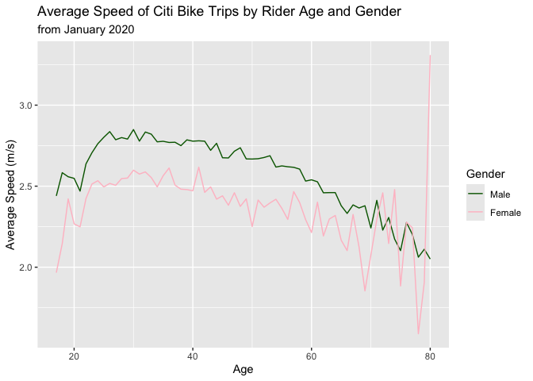
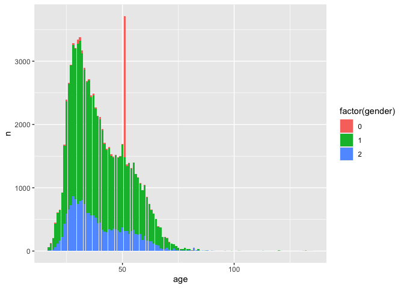
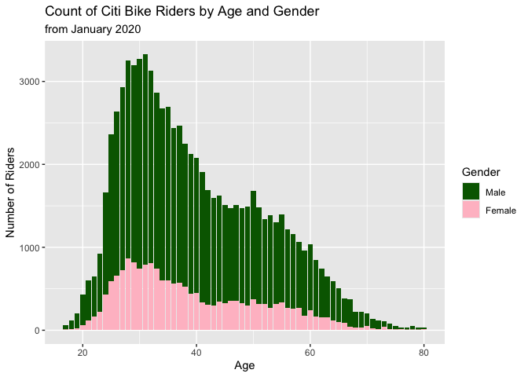

### Citi Bike Data

I Welcome to the off platform project focused on visualization. In this project, we will be exploring data associated with the New York City bike share program, Citi Bike! Remember, it may be easiest to read these instructions by clicking on the "Preview" button in RStudio.

There are over 850 Citi Bike stations in New York City — users check a bike out from a starting station and then dock that bike at a different station when they reach their destination. Citi Bike offers a variety of memberships, but most memberships allow for trips between 30 and 45 minutes — this will be relevant once we start digging into the dataset.

Citi Bike publically releases a variety of datasets. We've included a dataset containing information about individual trips from January of 2020. If you'd like to download a more recent dataset, or investigate other data that Citi Bike provides, take a look at their [System Data](https://www.citibikenyc.com/system-data) page. There are so many interesting questions that you can investigate with this data — we're about to walk you through a few, but we'd love to see what else you can discover!

### Investigate the Data

We've included a file named `january_trips.csv`. Load this data into a dataframe using the `read.csv()` function. Note that this dataset is *big*. It may take a few minutes to load — if you'd like to use a subset of this data that will take less time to load, we've included a file named `january_trips_subset.csv` as well. We strongly recommend using this subset of the data. When loading these datasets, make sure that the .csv files are in the same directory as this .Rmd file.

Note that because this dataset is so large, it may take several seconds to load the data or preview your R Notebook.


``` r
# Load the data set into a data frame

all_data <- read.csv("january_trips_subset.csv")
```

Now that we've loaded the dataset, the easiest way to investigate the data is to click on the variable name in the "Global Environment" tab in RStudio. This will let you scroll through the data as if it were a spreadsheet. If you want to display some of the data in this document, call the `head()` function using your data frame as a parameter. Make sure to scroll through all of the columns!


``` r
# Investigate the data

head(all_data)
```

<div data-pagedtable="false">
  <script data-pagedtable-source type="application/json">
{"columns":[{"label":[""],"name":["_rn_"],"type":[""],"align":["left"]},{"label":["X"],"name":[1],"type":["int"],"align":["right"]},{"label":["tripduration"],"name":[2],"type":["int"],"align":["right"]},{"label":["starttime"],"name":[3],"type":["chr"],"align":["left"]},{"label":["stoptime"],"name":[4],"type":["chr"],"align":["left"]},{"label":["start.station.id"],"name":[5],"type":["int"],"align":["right"]},{"label":["start.station.name"],"name":[6],"type":["chr"],"align":["left"]},{"label":["start.station.latitude"],"name":[7],"type":["dbl"],"align":["right"]},{"label":["start.station.longitude"],"name":[8],"type":["dbl"],"align":["right"]},{"label":["end.station.id"],"name":[9],"type":["int"],"align":["right"]},{"label":["end.station.name"],"name":[10],"type":["chr"],"align":["left"]},{"label":["end.station.latitude"],"name":[11],"type":["dbl"],"align":["right"]},{"label":["end.station.longitude"],"name":[12],"type":["dbl"],"align":["right"]},{"label":["bikeid"],"name":[13],"type":["int"],"align":["right"]},{"label":["usertype"],"name":[14],"type":["chr"],"align":["left"]},{"label":["birth.year"],"name":[15],"type":["int"],"align":["right"]},{"label":["gender"],"name":[16],"type":["int"],"align":["right"]}],"data":[{"1":"1","2":"1420","3":"2020-01-12 11:58:32.4220","4":"2020-01-12 12:22:12.5870","5":"3256","6":"Pier 40 - Hudson River Park","7":"40.72771","8":"-74.01130","9":"412","10":"Forsyth St & Canal St","11":"40.71582","12":"-73.99422","13":"41482","14":"Customer","15":"1994","16":"1","_rn_":"1"},{"1":"2","2":"539","3":"2020-01-05 09:37:51.3740","4":"2020-01-05 09:46:50.7600","5":"128","6":"MacDougal St & Prince St","7":"40.72710","8":"-74.00297","9":"168","10":"W 18 St & 6 Ave","11":"40.73971","12":"-73.99456","13":"19904","14":"Subscriber","15":"1965","16":"2","_rn_":"2"},{"1":"3","2":"238","3":"2020-01-25 10:47:55.5770","4":"2020-01-25 10:51:53.9540","5":"276","6":"Duane St & Greenwich St","7":"40.71749","8":"-74.01046","9":"327","10":"Vesey Pl & River Terrace","11":"40.71534","12":"-74.01658","13":"38561","14":"Subscriber","15":"1944","16":"1","_rn_":"3"},{"1":"4","2":"189","3":"2020-01-17 08:03:12.6320","4":"2020-01-17 08:06:21.8730","5":"3689","6":"W 104 St & Amsterdam Ave","7":"40.79904","8":"-73.96649","9":"3328","10":"W 100 St & Manhattan Ave","11":"40.79500","12":"-73.96450","13":"35170","14":"Subscriber","15":"1960","16":"1","_rn_":"4"},{"1":"5","2":"741","3":"2020-01-23 22:42:59.9520","4":"2020-01-23 22:55:21.5230","5":"3420","6":"Douglass St & 3 Ave","7":"40.68021","8":"-73.98433","9":"3558","10":"Bergen St & Vanderbilt Ave","11":"40.67944","12":"-73.96804","13":"17359","14":"Subscriber","15":"1992","16":"2","_rn_":"5"},{"1":"6","2":"568","3":"2020-01-15 20:37:44.8000","4":"2020-01-15 20:47:13.2320","5":"252","6":"MacDougal St & Washington Sq","7":"40.73226","8":"-73.99852","9":"150","10":"E 2 St & Avenue C","11":"40.72087","12":"-73.98086","13":"29881","14":"Subscriber","15":"1996","16":"1","_rn_":"6"}],"options":{"columns":{"min":{},"max":[10]},"rows":{"min":[10],"max":[10]},"pages":{}}}
  </script>
</div>

Since we have information about the starting and ending location for each trip, let's quickly make a heat map of the starting locations. Make a heat map using `ggplot()` and `geom_bin2d()`. If you make the bin width for each axis very small (we used `0.001`), you should see the shape of Manhattan, Brooklyn, and Queens! Check out the rectangle in Manhattan with no stations — that's Central Park!

Make sure to install and load `ggplot2` and `dplyr`!


``` r
# Install and load ggplot2 and dplyr
library(ggplot2)
library(dplyr)
```

```
## 
## Attaching package: 'dplyr'
```

```
## The following objects are masked from 'package:stats':
## 
##     filter, lag
```

```
## The following objects are masked from 'package:base':
## 
##     intersect, setdiff, setequal, union
```

``` r
# Create a heatmap
heatmap <- ggplot(all_data, 
                  aes(x=start.station.longitude,
                      y=start.station.latitude)) +
  geom_bin2d(binwidth=c(0.001, 0.001))
heatmap
```

<!-- -->

We also have the duration of each trip. Using these features, we can calculate the average speed of each trip.

Finally, since we also have the date of birth for each rider, we can calculate their age.

Let's work towards building a line graph where age is on the x axis and average speed is on the y axis. This graph could help Citi Bike understand how their users are using their bikes. For example, if younger riders tend to bike much faster than older riders, Citi Bike may want to think about ways to encourage younger riders to bike more cautiously.

Before we begin to work on the visualization, we'll have to work a bit with our dataset to get all of the relevant columns.

### Modifying the Data Frame: Subset and Age

Since this dataset is so big, we recommend using the `filter()` function to grab a subset of the data. For example, you could grab only the rows where the duration was under 900 seconds (15 minutes). We stored these rows in a new data frame named `short_trips`. Note that we did this only to speed up the runtime of upcoming operations. This is completely optional — if you're happy to wait a bit for each operation, feel free to use the complete data set.


``` r
# Create a subset of the data
medium_trips <- all_data %>%
  filter(tripduration <= 1200)
```

Next, let's add a column called `age` to the data frame. `age` should be 2020 minus `birth.year` (this data was collected in 2020). Use the `mutate()` function to do this. After calling mutate, make sure to save the result in a variable. We should save the result back to `short_trips`.


``` r
# Add the age column
medium_trips <- medium_trips %>%
  mutate(age = 2020 - birth.year)
head(medium_trips)
```

<div data-pagedtable="false">
  <script data-pagedtable-source type="application/json">
{"columns":[{"label":[""],"name":["_rn_"],"type":[""],"align":["left"]},{"label":["X"],"name":[1],"type":["int"],"align":["right"]},{"label":["tripduration"],"name":[2],"type":["int"],"align":["right"]},{"label":["starttime"],"name":[3],"type":["chr"],"align":["left"]},{"label":["stoptime"],"name":[4],"type":["chr"],"align":["left"]},{"label":["start.station.id"],"name":[5],"type":["int"],"align":["right"]},{"label":["start.station.name"],"name":[6],"type":["chr"],"align":["left"]},{"label":["start.station.latitude"],"name":[7],"type":["dbl"],"align":["right"]},{"label":["start.station.longitude"],"name":[8],"type":["dbl"],"align":["right"]},{"label":["end.station.id"],"name":[9],"type":["int"],"align":["right"]},{"label":["end.station.name"],"name":[10],"type":["chr"],"align":["left"]},{"label":["end.station.latitude"],"name":[11],"type":["dbl"],"align":["right"]},{"label":["end.station.longitude"],"name":[12],"type":["dbl"],"align":["right"]},{"label":["bikeid"],"name":[13],"type":["int"],"align":["right"]},{"label":["usertype"],"name":[14],"type":["chr"],"align":["left"]},{"label":["birth.year"],"name":[15],"type":["int"],"align":["right"]},{"label":["gender"],"name":[16],"type":["int"],"align":["right"]},{"label":["age"],"name":[17],"type":["dbl"],"align":["right"]}],"data":[{"1":"2","2":"539","3":"2020-01-05 09:37:51.3740","4":"2020-01-05 09:46:50.7600","5":"128","6":"MacDougal St & Prince St","7":"40.72710","8":"-74.00297","9":"168","10":"W 18 St & 6 Ave","11":"40.73971","12":"-73.99456","13":"19904","14":"Subscriber","15":"1965","16":"2","17":"55","_rn_":"1"},{"1":"3","2":"238","3":"2020-01-25 10:47:55.5770","4":"2020-01-25 10:51:53.9540","5":"276","6":"Duane St & Greenwich St","7":"40.71749","8":"-74.01046","9":"327","10":"Vesey Pl & River Terrace","11":"40.71534","12":"-74.01658","13":"38561","14":"Subscriber","15":"1944","16":"1","17":"76","_rn_":"2"},{"1":"4","2":"189","3":"2020-01-17 08:03:12.6320","4":"2020-01-17 08:06:21.8730","5":"3689","6":"W 104 St & Amsterdam Ave","7":"40.79904","8":"-73.96649","9":"3328","10":"W 100 St & Manhattan Ave","11":"40.79500","12":"-73.96450","13":"35170","14":"Subscriber","15":"1960","16":"1","17":"60","_rn_":"3"},{"1":"5","2":"741","3":"2020-01-23 22:42:59.9520","4":"2020-01-23 22:55:21.5230","5":"3420","6":"Douglass St & 3 Ave","7":"40.68021","8":"-73.98433","9":"3558","10":"Bergen St & Vanderbilt Ave","11":"40.67944","12":"-73.96804","13":"17359","14":"Subscriber","15":"1992","16":"2","17":"28","_rn_":"4"},{"1":"6","2":"568","3":"2020-01-15 20:37:44.8000","4":"2020-01-15 20:47:13.2320","5":"252","6":"MacDougal St & Washington Sq","7":"40.73226","8":"-73.99852","9":"150","10":"E 2 St & Avenue C","11":"40.72087","12":"-73.98086","13":"29881","14":"Subscriber","15":"1996","16":"1","17":"24","_rn_":"5"},{"1":"7","2":"710","3":"2020-01-11 12:11:02.1250","4":"2020-01-11 12:22:52.8890","5":"252","6":"MacDougal St & Washington Sq","7":"40.73226","8":"-73.99852","9":"151","10":"Cleveland Pl & Spring St","11":"40.72210","12":"-73.99725","13":"32847","14":"Subscriber","15":"1986","16":"1","17":"34","_rn_":"6"}],"options":{"columns":{"min":{},"max":[10]},"rows":{"min":[10],"max":[10]},"pages":{}}}
  </script>
</div>

### Modifying the Data Frame: Distance

In order to calculate the speed of each biker, we need to find the total distance they traveled. Luckily, we have information about the starting and ending latitudes and longitudes. Let's use those four columns to create a new column named `distance`.

There are many different ways to calculate distance. We'll walk you through the strategy we used. However, before following along with us, challenge yourself to solve this problem on your own — one of the goals of these off platform projects is to get comfortable problem solving on your own. Try to use Google to find the packages you might need to calculate the distance between latitude and longitude coordinates. Use the code block below to try solving this problem on your own. We'll walk you through our solution in the following section.

As you write your code that edits the data frame, consider printing the head of the data frame to validate the work you are doing!


``` r
# Try creating a distance column in your data frame here:
#install.packages('geosphere')
library(geosphere)

# distGeo(c(start.station.longitude, start.station.latitude),
        # c(end.station.longitude, end.station.latitude))

# distm(c(start.station.longitude, start.station.latitude), 
      # c(end.station.longitude, end.station.latitude), 
      # fun = distGeo)
```

There are many different strategies to calculate the distance between two points. The simplest way to do this would be to find the length of the straight line between the two points. This is a massive assumption to make — it would be remarkable if any of these bike trips traveled in a straight line between the two points without making any turns or curves.

That being said, finding the straight line distance is a good starting point. The `distHaversine()` function found in the `geosphere` library can calculate this distance.

First, install and load the `geosphere` library.

Next, use `dplyr`'s `select()` function to create two new data frames that contain only the latitudes and longitudes of the starting and ending points. We called these data frames `starting_stations` and `ending_stations`.

Finally, use `dplyr`'s `mutate()` function to add a column named `distance` to your data. `distance` should be calculated by calling `distHaversine()` using `starting_stations` and `ending_stations` as parameters.

If you get stuck, use `?distHaversine` to check the documentation to see more examples! You can also use the documentation to find the units of the result of `distHaversine()`!


``` r
# Use the geosphere library to create a distance column
starting_stations <- select(medium_trips, start.station.longitude, start.station.latitude)

ending_stations <- select(medium_trips, end.station.longitude, end.station.latitude)

medium_trips <- medium_trips %>%
  mutate(distance = distHaversine(starting_stations, ending_stations))
head(medium_trips)
```

<div data-pagedtable="false">
  <script data-pagedtable-source type="application/json">
{"columns":[{"label":[""],"name":["_rn_"],"type":[""],"align":["left"]},{"label":["X"],"name":[1],"type":["int"],"align":["right"]},{"label":["tripduration"],"name":[2],"type":["int"],"align":["right"]},{"label":["starttime"],"name":[3],"type":["chr"],"align":["left"]},{"label":["stoptime"],"name":[4],"type":["chr"],"align":["left"]},{"label":["start.station.id"],"name":[5],"type":["int"],"align":["right"]},{"label":["start.station.name"],"name":[6],"type":["chr"],"align":["left"]},{"label":["start.station.latitude"],"name":[7],"type":["dbl"],"align":["right"]},{"label":["start.station.longitude"],"name":[8],"type":["dbl"],"align":["right"]},{"label":["end.station.id"],"name":[9],"type":["int"],"align":["right"]},{"label":["end.station.name"],"name":[10],"type":["chr"],"align":["left"]},{"label":["end.station.latitude"],"name":[11],"type":["dbl"],"align":["right"]},{"label":["end.station.longitude"],"name":[12],"type":["dbl"],"align":["right"]},{"label":["bikeid"],"name":[13],"type":["int"],"align":["right"]},{"label":["usertype"],"name":[14],"type":["chr"],"align":["left"]},{"label":["birth.year"],"name":[15],"type":["int"],"align":["right"]},{"label":["gender"],"name":[16],"type":["int"],"align":["right"]},{"label":["age"],"name":[17],"type":["dbl"],"align":["right"]},{"label":["distance"],"name":[18],"type":["dbl"],"align":["right"]}],"data":[{"1":"2","2":"539","3":"2020-01-05 09:37:51.3740","4":"2020-01-05 09:46:50.7600","5":"128","6":"MacDougal St & Prince St","7":"40.72710","8":"-74.00297","9":"168","10":"W 18 St & 6 Ave","11":"40.73971","12":"-73.99456","13":"19904","14":"Subscriber","15":"1965","16":"2","17":"55","18":"1572.7351","_rn_":"1"},{"1":"3","2":"238","3":"2020-01-25 10:47:55.5770","4":"2020-01-25 10:51:53.9540","5":"276","6":"Duane St & Greenwich St","7":"40.71749","8":"-74.01046","9":"327","10":"Vesey Pl & River Terrace","11":"40.71534","12":"-74.01658","13":"38561","14":"Subscriber","15":"1944","16":"1","17":"76","18":"569.7461","_rn_":"2"},{"1":"4","2":"189","3":"2020-01-17 08:03:12.6320","4":"2020-01-17 08:06:21.8730","5":"3689","6":"W 104 St & Amsterdam Ave","7":"40.79904","8":"-73.96649","9":"3328","10":"W 100 St & Manhattan Ave","11":"40.79500","12":"-73.96450","13":"35170","14":"Subscriber","15":"1960","16":"1","17":"60","18":"480.2674","_rn_":"3"},{"1":"5","2":"741","3":"2020-01-23 22:42:59.9520","4":"2020-01-23 22:55:21.5230","5":"3420","6":"Douglass St & 3 Ave","7":"40.68021","8":"-73.98433","9":"3558","10":"Bergen St & Vanderbilt Ave","11":"40.67944","12":"-73.96804","13":"17359","14":"Subscriber","15":"1992","16":"2","17":"28","18":"1377.3357","_rn_":"4"},{"1":"6","2":"568","3":"2020-01-15 20:37:44.8000","4":"2020-01-15 20:47:13.2320","5":"252","6":"MacDougal St & Washington Sq","7":"40.73226","8":"-73.99852","9":"150","10":"E 2 St & Avenue C","11":"40.72087","12":"-73.98086","13":"29881","14":"Subscriber","15":"1996","16":"1","17":"24","18":"1956.6184","_rn_":"5"},{"1":"7","2":"710","3":"2020-01-11 12:11:02.1250","4":"2020-01-11 12:22:52.8890","5":"252","6":"MacDougal St & Washington Sq","7":"40.73226","8":"-73.99852","9":"151","10":"Cleveland Pl & Spring St","11":"40.72210","12":"-73.99725","13":"32847","14":"Subscriber","15":"1986","16":"1","17":"34","18":"1136.1148","_rn_":"6"}],"options":{"columns":{"min":{},"max":[10]},"rows":{"min":[10],"max":[10]},"pages":{}}}
  </script>
</div>

``` r
# default unit for output of distHaversine is meters
```

### Modifying the Data Frame: Speed

Now that we've made a column containing the distance of each trip, let's make another column containing the average speed of each trip. This column should be easier to create than the previous — speed can be calculated by dividing the `distance` column by the `tripduration` column. This will give us the average speed in meters per second. Use the `mutate()` function to make the `speed` column!


``` r
# Create the speed column
medium_trips <- medium_trips %>%
  mutate(speed = distance/tripduration)
head(medium_trips)
```

<div data-pagedtable="false">
  <script data-pagedtable-source type="application/json">
{"columns":[{"label":[""],"name":["_rn_"],"type":[""],"align":["left"]},{"label":["X"],"name":[1],"type":["int"],"align":["right"]},{"label":["tripduration"],"name":[2],"type":["int"],"align":["right"]},{"label":["starttime"],"name":[3],"type":["chr"],"align":["left"]},{"label":["stoptime"],"name":[4],"type":["chr"],"align":["left"]},{"label":["start.station.id"],"name":[5],"type":["int"],"align":["right"]},{"label":["start.station.name"],"name":[6],"type":["chr"],"align":["left"]},{"label":["start.station.latitude"],"name":[7],"type":["dbl"],"align":["right"]},{"label":["start.station.longitude"],"name":[8],"type":["dbl"],"align":["right"]},{"label":["end.station.id"],"name":[9],"type":["int"],"align":["right"]},{"label":["end.station.name"],"name":[10],"type":["chr"],"align":["left"]},{"label":["end.station.latitude"],"name":[11],"type":["dbl"],"align":["right"]},{"label":["end.station.longitude"],"name":[12],"type":["dbl"],"align":["right"]},{"label":["bikeid"],"name":[13],"type":["int"],"align":["right"]},{"label":["usertype"],"name":[14],"type":["chr"],"align":["left"]},{"label":["birth.year"],"name":[15],"type":["int"],"align":["right"]},{"label":["gender"],"name":[16],"type":["int"],"align":["right"]},{"label":["age"],"name":[17],"type":["dbl"],"align":["right"]},{"label":["distance"],"name":[18],"type":["dbl"],"align":["right"]},{"label":["speed"],"name":[19],"type":["dbl"],"align":["right"]}],"data":[{"1":"2","2":"539","3":"2020-01-05 09:37:51.3740","4":"2020-01-05 09:46:50.7600","5":"128","6":"MacDougal St & Prince St","7":"40.72710","8":"-74.00297","9":"168","10":"W 18 St & 6 Ave","11":"40.73971","12":"-73.99456","13":"19904","14":"Subscriber","15":"1965","16":"2","17":"55","18":"1572.7351","19":"2.917876","_rn_":"1"},{"1":"3","2":"238","3":"2020-01-25 10:47:55.5770","4":"2020-01-25 10:51:53.9540","5":"276","6":"Duane St & Greenwich St","7":"40.71749","8":"-74.01046","9":"327","10":"Vesey Pl & River Terrace","11":"40.71534","12":"-74.01658","13":"38561","14":"Subscriber","15":"1944","16":"1","17":"76","18":"569.7461","19":"2.393891","_rn_":"2"},{"1":"4","2":"189","3":"2020-01-17 08:03:12.6320","4":"2020-01-17 08:06:21.8730","5":"3689","6":"W 104 St & Amsterdam Ave","7":"40.79904","8":"-73.96649","9":"3328","10":"W 100 St & Manhattan Ave","11":"40.79500","12":"-73.96450","13":"35170","14":"Subscriber","15":"1960","16":"1","17":"60","18":"480.2674","19":"2.541098","_rn_":"3"},{"1":"5","2":"741","3":"2020-01-23 22:42:59.9520","4":"2020-01-23 22:55:21.5230","5":"3420","6":"Douglass St & 3 Ave","7":"40.68021","8":"-73.98433","9":"3558","10":"Bergen St & Vanderbilt Ave","11":"40.67944","12":"-73.96804","13":"17359","14":"Subscriber","15":"1992","16":"2","17":"28","18":"1377.3357","19":"1.858753","_rn_":"4"},{"1":"6","2":"568","3":"2020-01-15 20:37:44.8000","4":"2020-01-15 20:47:13.2320","5":"252","6":"MacDougal St & Washington Sq","7":"40.73226","8":"-73.99852","9":"150","10":"E 2 St & Avenue C","11":"40.72087","12":"-73.98086","13":"29881","14":"Subscriber","15":"1996","16":"1","17":"24","18":"1956.6184","19":"3.444751","_rn_":"5"},{"1":"7","2":"710","3":"2020-01-11 12:11:02.1250","4":"2020-01-11 12:22:52.8890","5":"252","6":"MacDougal St & Washington Sq","7":"40.73226","8":"-73.99852","9":"151","10":"Cleveland Pl & Spring St","11":"40.72210","12":"-73.99725","13":"32847","14":"Subscriber","15":"1986","16":"1","17":"34","18":"1136.1148","19":"1.600162","_rn_":"6"}],"options":{"columns":{"min":{},"max":[10]},"rows":{"min":[10],"max":[10]},"pages":{}}}
  </script>
</div>

### Modifying the Data Frame: Average Speed by Age

We're almost there! Now that we have the speed of every bike trip, we want to group those trips by `age` and find the average speed of each age.

Do this by piping your data frame into the `group_by()` function using `age` as a parameter.

Then pipe the result of that function into the `summarize()` function. `summarize()` works similarly to `mutate()` — pass `mean_speed = mean(speed)` to the `summarize()` function to create a new column named `mean_speed`. Save this new data frame in a variable called `average_speed_by_age`.


``` r
# Use group_by() and summarize() to get the mean speed of each age
average_speed_by_age <- medium_trips %>%
  group_by(age) %>%
  summarize(mean_speed = mean(speed))
average_speed_by_age
```

<div data-pagedtable="false">
  <script data-pagedtable-source type="application/json">
{"columns":[{"label":["age"],"name":[1],"type":["dbl"],"align":["right"]},{"label":["mean_speed"],"name":[2],"type":["dbl"],"align":["right"]}],"data":[{"1":"17","2":"2.386561"},{"1":"18","2":"2.533725"},{"1":"19","2":"2.531005"},{"1":"20","2":"2.503441"},{"1":"21","2":"2.428733"},{"1":"22","2":"2.575756"},{"1":"23","2":"2.658957"},{"1":"24","2":"2.710214"},{"1":"25","2":"2.722464"},{"1":"26","2":"2.756694"},{"1":"27","2":"2.718279"},{"1":"28","2":"2.726358"},{"1":"29","2":"2.727878"},{"1":"30","2":"2.791111"},{"1":"31","2":"2.729267"},{"1":"32","2":"2.768944"},{"1":"33","2":"2.751046"},{"1":"34","2":"2.709164"},{"1":"35","2":"2.735444"},{"1":"36","2":"2.732727"},{"1":"37","2":"2.713594"},{"1":"38","2":"2.681392"},{"1":"39","2":"2.717810"},{"1":"40","2":"2.717546"},{"1":"41","2":"2.748730"},{"1":"42","2":"2.718305"},{"1":"43","2":"2.681086"},{"1":"44","2":"2.687296"},{"1":"45","2":"2.622688"},{"1":"46","2":"2.604326"},{"1":"47","2":"2.655952"},{"1":"48","2":"2.662639"},{"1":"49","2":"2.619539"},{"1":"50","2":"2.578764"},{"1":"51","2":"2.417815"},{"1":"52","2":"2.606062"},{"1":"53","2":"2.631844"},{"1":"54","2":"2.568406"},{"1":"55","2":"2.562708"},{"1":"56","2":"2.549347"},{"1":"57","2":"2.580749"},{"1":"58","2":"2.552066"},{"1":"59","2":"2.487351"},{"1":"60","2":"2.461615"},{"1":"61","2":"2.502788"},{"1":"62","2":"2.405774"},{"1":"63","2":"2.416535"},{"1":"64","2":"2.432360"},{"1":"65","2":"2.336021"},{"1":"66","2":"2.259661"},{"1":"67","2":"2.378628"},{"1":"68","2":"2.330467"},{"1":"69","2":"2.305517"},{"1":"70","2":"2.199719"},{"1":"71","2":"2.402052"},{"1":"72","2":"2.263897"},{"1":"73","2":"2.249863"},{"1":"74","2":"2.231535"},{"1":"75","2":"2.069486"},{"1":"76","2":"2.276659"},{"1":"77","2":"2.207718"},{"1":"78","2":"2.001636"},{"1":"79","2":"2.078943"},{"1":"80","2":"2.424652"},{"1":"81","2":"1.959300"},{"1":"82","2":"2.290302"},{"1":"83","2":"1.841891"},{"1":"84","2":"2.428935"},{"1":"85","2":"1.754777"},{"1":"86","2":"1.942153"},{"1":"87","2":"2.315526"},{"1":"88","2":"2.592458"},{"1":"90","2":"1.998180"},{"1":"91","2":"2.123619"},{"1":"96","2":"2.256750"},{"1":"99","2":"2.298628"},{"1":"102","2":"1.824242"},{"1":"103","2":"1.426198"},{"1":"113","2":"3.358362"},{"1":"120","2":"1.908130"},{"1":"121","2":"2.563876"},{"1":"131","2":"3.131993"},{"1":"132","2":"2.951091"},{"1":"133","2":"3.073540"},{"1":"134","2":"2.250716"},{"1":"135","2":"2.182562"}],"options":{"columns":{"min":{},"max":[10]},"rows":{"min":[10],"max":[10]},"pages":{}}}
  </script>
</div>

### Visualization!

We made it! We now have the average speed of every age in our dataset. Let's use `ggplot2` to make a line graph to see if younger people really do bike faster. Make sure to install and load `ggplot2` if you haven't done so already. Pass your data frame to `ggplot()` and add a `geom_line()`. `geom_line()` should contain an aesthetic where `x = age` and `y = mean_speed`.


``` r
# Install and load ggplot2 to create a line graph of age and mean speed
linegraph <- ggplot(average_speed_by_age, aes(x=age, y=mean_speed)) +
    geom_line()
linegraph
```

<!-- -->

Nice work! Our intuition seems to be right — there's a steady drop in speed until we hit some outliers. It would be pretty surprising to see someone over the age of 100 using a bike share program! Let's filter the data to only show ages less than 80 and redraw our visualization.


``` r
# Filter the data frame to only contain rows where the age is less than 80
average_speed_by_age <- filter(average_speed_by_age, age <= 80)
linegraph <- ggplot(average_speed_by_age, aes(x=age, y=mean_speed)) +
    geom_line()
linegraph
```

<!-- -->

That looks a bit better! Let's do some work to make our graph look a bit more professional. Add a title and axis labels. We also centered our title!


``` r
# Add a title and label the axes
linegraph <- ggplot(average_speed_by_age, aes(x=age, y=mean_speed)) +
    geom_line() +
    labs(title = "Average Speed of Citi Bike Trips by Rider Age", x='Age', y='Average Speed (m/s)', subtitle='from January 2020')
linegraph
```

<!-- -->

### Filtering By Gender

Great work! This visualization gives us some great insights on how Citi Bike users are using their bikes. Let's dive even deeper! We can group our data by more than one feature.

Find your line of code that grouped our data by `age`. Copy it, but add `gender` as a parameter to the `group_by()` function. Save the result in a data frame named `average_speed_by_age_and_gender`. Inspect this data frame to see what it contains.


``` r
# Use group_by() again to group by both age and gender
average_speed_by_age_and_gender <- medium_trips %>%
  group_by(age, gender) %>% 
  summarize(mean_speed = mean(speed))
```

```
## `summarise()` has grouped output by 'age'. You can override using the `.groups`
## argument.
```

``` r
head(average_speed_by_age_and_gender)
```

<div data-pagedtable="false">
  <script data-pagedtable-source type="application/json">
{"columns":[{"label":["age"],"name":[1],"type":["dbl"],"align":["right"]},{"label":["gender"],"name":[2],"type":["int"],"align":["right"]},{"label":["mean_speed"],"name":[3],"type":["dbl"],"align":["right"]}],"data":[{"1":"17","2":"1","3":"2.440017"},{"1":"17","2":"2","3":"1.966547"},{"1":"18","2":"0","3":"2.177695"},{"1":"18","2":"1","3":"2.583281"},{"1":"18","2":"2","3":"2.145603"},{"1":"19","2":"0","3":"1.603640"}],"options":{"columns":{"min":{},"max":[10]},"rows":{"min":[10],"max":[10]},"pages":{}}}
  </script>
</div>

Let's now visualize the difference in average speed by age *and* gender. Note that if you look in the documentation for the data, a `0` represents a user that didn't specify their gender as male or female, a `1` represents a user identifying as male, and a `2` represents a user identifying as female.

The previous call to `ggplot()` and `geom_line()` should be close to what we want. Add the parameter `color = gender` to the aesthetic in `geom_line()`. Make sure you use the new data containing the gender information! You once again may want to filter out the ages greater than 80.

Note that this graph won't quite be what we want yet, but we're getting close!


``` r
# Make a line graph of your new filtered data frame
average_speed_by_age_and_gender <- filter(average_speed_by_age_and_gender, age <= 80)

linegraph <- ggplot(average_speed_by_age_and_gender, aes(x=age, y=mean_speed, color=factor(gender))) + geom_line()
linegraph
```

<!-- -->

It's a bit hard to tell what is happening in that graph — but one oddity that sticks out is the scale used for gender. We know that our gender data is represented as three distinct values — `0`, `1`, and `2`. However, `ggplot()` is using gender as a continuous variable.

We can turn this column into a factor by using the `as.factor()` and `mutate()` functions. Pipe your data frame into the `mutate()` function and use `gender = as.factor(gender)` as the parameter.

Note that when you make this column a factor, you will see a number of warnings. This warning is telling you that the type of the values in the gender column have been changed from integers to characters.

Then redraw your graph.


``` r
# Use mutate() and as.factor() to change the gender column into a factor.
```

Nice work! We can now see the average speeds by age broken into the 3 genders Citi Bike accounts for. You can see that male-identifying users typically bike faster than female-identifying users. Users with an unknown gender don't follow a specific pattern — it is likely that there isn't enough data to properly visualize those users.

For our final version of this graph, we filtered out the users with a gender of `0`, and we labeled the lines as "Male Identifying" and "Female Identifying" using the `scale_color_discrete()` function. Take a look at the documentation for this function using `?scale_color_discrete` to change the label of each line.


``` r
# Filter the data frame to only include genders 1 and 2. Set appropriate labels for the legend
average_speed_by_age_and_gender <- average_speed_by_age_and_gender %>%
  filter(gender != 0)

linegraph <- ggplot(average_speed_by_age_and_gender, 
                    aes(x=age, y=mean_speed, color=factor(gender))) + 
                    geom_line() +
                    scale_color_manual(name='Gender', labels = c("1"="Male", "2"="Female"), values = c('darkgreen','pink')) +
                    labs(x='Age', y='Average Speed (m/s)', color='Gender', title='Average Speed of Citi Bike Trips by Rider Age and Gender', subtitle='from January 2020')
linegraph
```

<!-- -->

### Making a Stacked Bar Plot Of Ages

Let's make one final graph. For this graph, we're interested in seeing the distribution of Citi Bike users' age and gender. Let's use a stacked bar plot to do this. We'll want to create a bar plot where age is on the x axis, count is on the y axis, and each bar is split into genders.

Let's start by using our `short_trips` dataset. We'll want to call `group_by()` using this dataset and pipe the result to `tally()`. This will let us get a count of the number of bikers for each age and gender. We saved this new data frame in a variable called `age_counts`.


``` r
# Create the age_counts data frame
age_counts <- medium_trips %>% 
  group_by(age, gender) %>% 
  tally()
head(age_counts)
```

<div data-pagedtable="false">
  <script data-pagedtable-source type="application/json">
{"columns":[{"label":["age"],"name":[1],"type":["dbl"],"align":["right"]},{"label":["gender"],"name":[2],"type":["int"],"align":["right"]},{"label":["n"],"name":[3],"type":["int"],"align":["right"]}],"data":[{"1":"17","2":"1","3":"55"},{"1":"17","2":"2","3":"7"},{"1":"18","2":"0","3":"1"},{"1":"18","2":"1","3":"109"},{"1":"18","2":"2","3":"13"},{"1":"19","2":"0","3":"2"}],"options":{"columns":{"min":{},"max":[10]},"rows":{"min":[10],"max":[10]},"pages":{}}}
  </script>
</div>

If you look at the head of this new data frame, you'll see the counts are stored in a column named `n`. Let's now use `ggplot()` and `geom_col()` to create a stacked bar plot. `ggplot()` should have an `aes()` where `x = age`, `y = n` and `fill = gender`.


``` r
# Create the stacked bar plot
stacked_bar <- ggplot(age_counts, aes(x=age, y=n, fill=factor(gender))) +
                geom_col()
stacked_bar
```

<!-- -->

Great! There are some tweaks that we might want to make to this graph. First, gender right now is represented as an integer. It will make more sense if that column is represented as a factor. To do this, we can pass `as.factor(gender)` as the value for the x axis.

Next, it looks like we have some unusual data around the age of 50. It looks like there are a ton of bikers with an unknown gender at that age. This might be something we want to dig into a bit more, but for now, let's filter out the bikers with a gender of `0`. We also filtered out bikers with an age over `100` — that seems like an error in data collection as well.

Finally, we labeled and titled our graph using `labs()` and `scale_fill_discrete()`


``` r
# Filter and label your graph
age_counts <- age_counts %>% 
  filter(age <= 80, gender != 0)

stacked_bar <- ggplot(age_counts, aes(x=age, y=n, fill=factor(gender))) +
                geom_col() +
                labs(x='Age', y='Number of Riders', fill='Gender', title='Count of Citi Bike Riders by Age and Gender', subtitle='from January 2020') +
                scale_fill_manual(values = c('darkgreen','pink'), name='Gender', labels = c("1"="Male", "2"="Female"))
stacked_bar
```

<!-- -->

### Further Work

Great work! You've made several graphs that show a real difference in the way different groups of Citi Bike users bike. This could be a valuable asset in helping Citi Bike understand how to make bike riding safer in New York. However, there is so much more you can do with this data!

To begin, there are some major flaws in the way we calculated the speed. Specifically, we made some *huge* assumptions when calculating the distance of each bike ride. Instead of calculating the straight line distance using the geosphere library, we could take advantage of a service like Google Map's API to get a more accurate measurement of distance. If you're interested in look more into this problem, investigate getting a [Google Maps API key](https://developers.google.com/maps/documentation/geocoding/get-api-key) and using a library like [gmapsdistance](https://cran.r-project.org/web/packages/gmapsdistance/gmapsdistance.pdf).

Another great way to extend this project is to investigate other data that Citi Bike makes available. We used data found in the *Citi Bike Trip Histories* section on the [System Data](https://www.citibikenyc.com/system-data) page. On the System Data page, you can find different dataset, including information about membership data and real time station data. You could use this real time data to track how the flow of bikes changes over the course of the day. You could investigate how the weather impacts membership. We would love to see any graphs or insights you produce!
